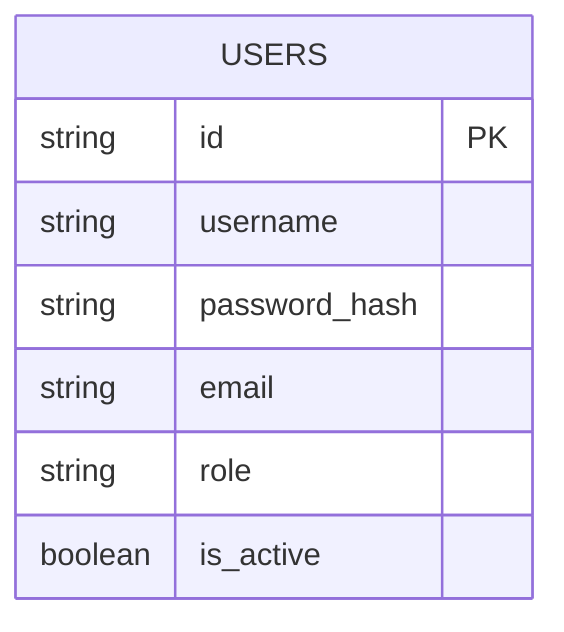
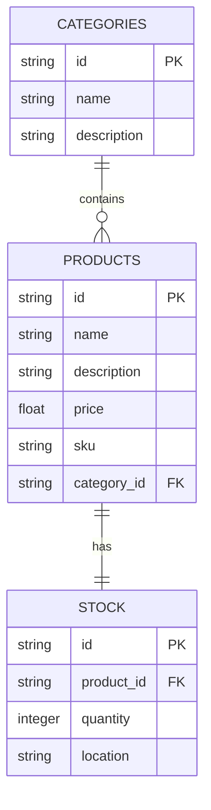
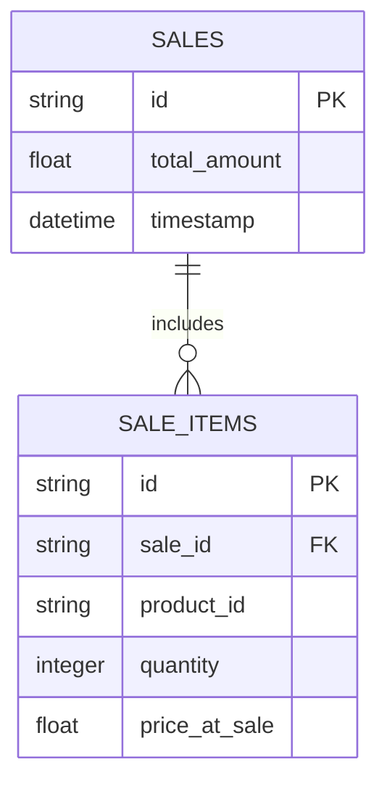
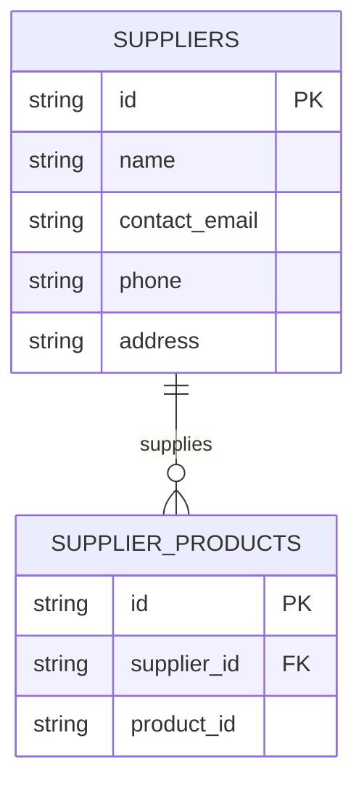

# Database Schema Documentation

This document describes the database schema for the microservices in the Grocery Store Inventory Management System. Each service maintains its own isolated database to ensure loose coupling.

## Overview

The system follows a microservices architecture where each service has its own dedicated database. Inter-service relationships are managed via **ID references** rather than hard Foreign Keys, as they reside in different databases.

---

## 1. Auth Service Schema

Responsible for user authentication and role management.

### Auth ER Diagram

### Auth Tables

| Table | Column | Type | Description |
| :--- | :--- | :--- | :--- |
| `users` | `id` | String (UUID) | Primary Key |
| | `username` | String | Unique username for login |
| | `password_hash` | String | Bcrypt hashed password |
| | `email` | String | Unique user email |
| | `role` | String | User role (admin/staff) |
| | `is_active` | Boolean | Account status |

---

## 2. Inventory Service Schema

Manages product categories, products, and their stock levels.

### Inventory ER Diagram

### Inventory Tables

| Table | Column | Type | Description |
| :--- | :--- | :--- | :--- |
| `categories` | `id` | String (UUID) | Primary Key |
| | `name` | String | Unique category name |
| | `description` | String | Optional description |
| `products` | `id` | String (UUID) | Primary Key |
| | `name` | String | Product name |
| | `sku` | String | Unique Stock Keeping Unit |
| | `price` | Float | Unit price |
| | `category_id` | String | FK to `categories.id` |
| `stock` | `id` | String (UUID) | Primary Key |
| | `product_id` | String | FK to `products.id` (Unique) |
| | `quantity` | Integer | Current available quantity |
| | `location` | String | Warehouse storage location |

---

## 3. Sales Service Schema

Tracks customer sales and individual items within those sales.

### Sales ER Diagram

### Sales Tables

| Table | Column | Type | Description |
| :--- | :--- | :--- | :--- |
| `sales` | `id` | String (UUID) | Primary Key |
| | `total_amount` | Float | Total value of the sale |
| | `timestamp` | DateTime | When the sale occurred |
| `sale_items` | `id` | String (UUID) | Primary Key |
| | `sale_id` | String | FK to `sales.id` |
| | `product_id` | String | Reference to Product in Inventory Service |
| | `quantity` | Integer | Number of units sold |
| | `price_at_sale` | Float | Price per unit at the time of sale |

---

## 4. Supplier Service Schema

Maintains information about suppliers and which products they provide.

### Supplier ER Diagram

### Supplier Tables

| Table | Column | Type | Description |
| :--- | :--- | :--- | :--- |
| `suppliers` | `id` | String (UUID) | Primary Key |
| | `name` | String | Supplier company name |
| | `contact_email` | String | Primary contact email |
| | `phone` | String | Contact phone number |
| `supplier_products` | `id` | String (UUID) | Primary Key |
| | `supplier_id` | String | FK to `suppliers.id` |
| | `product_id` | String | Reference to Product in Inventory Service |

---

## Cross-Service Data Links

While the databases are isolated, they are logically linked as follows:

1. **Sales Item -> Product**: `sale_items.product_id` matches `inventory.products.id`.
2. **Supplier Product -> Product**: `supplier_products.product_id` matches `inventory.products.id`.
3. **Traceability**: Both Sales and Supplier services rely on the Inventory service as the source of truth for product identity (IDs).
